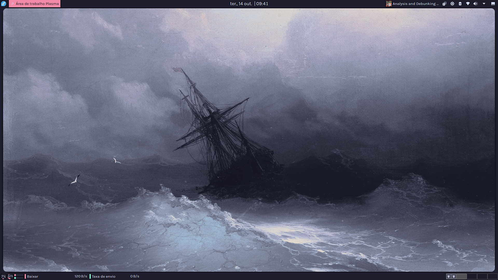
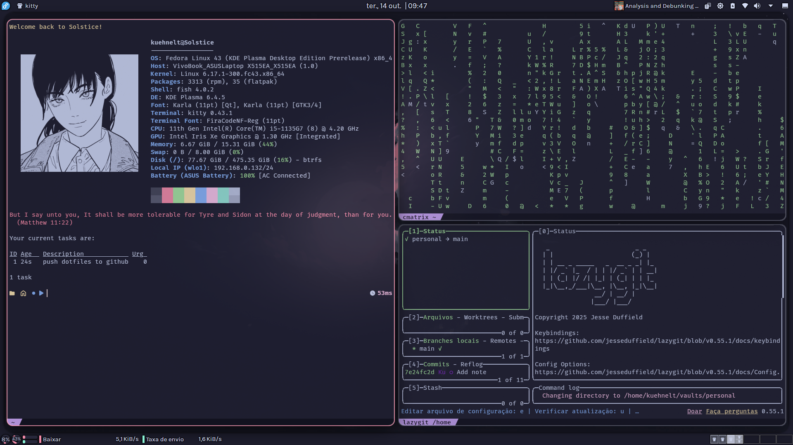
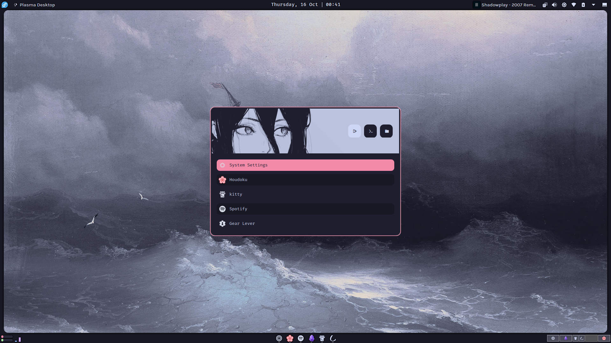
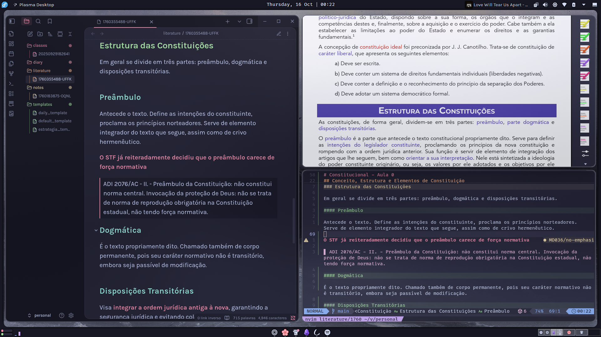
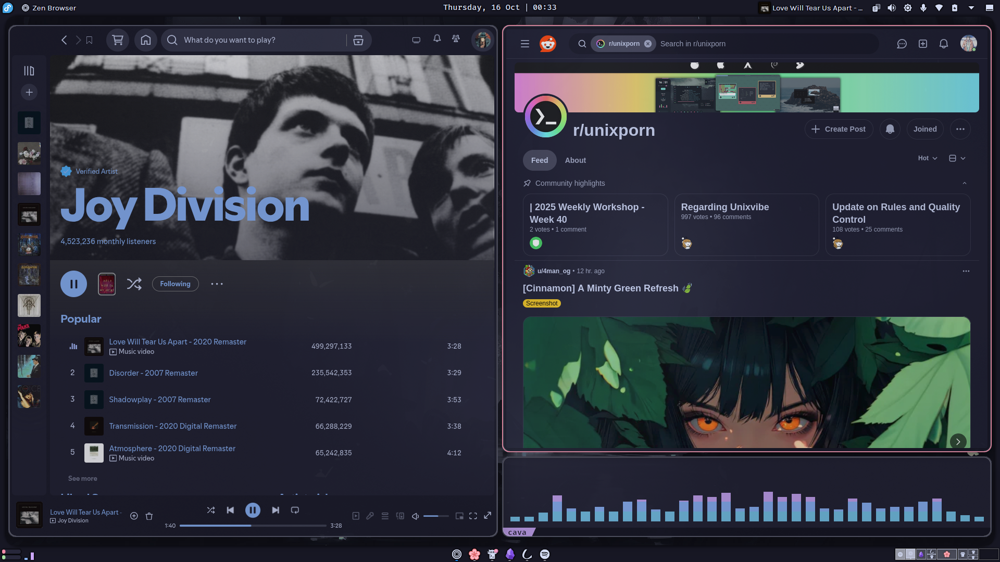
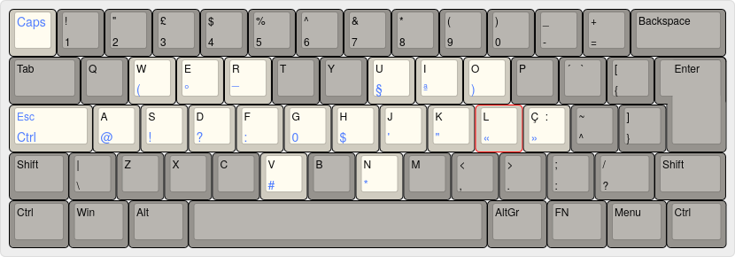

    
    <h1>Solstice Dots</h1>
    <h3></h3>

&nbsp;&nbsp;
&nbsp;&nbsp;
&nbsp;&nbsp;
&nbsp;&nbsp;

# Description

These are my personal dotfiles for daily driving Fedora KDE. This setup is a bit of a Frankenstein's monster, with some original work done by me. Most of it was inspired by a mix of [Pazl27](https://github.com/Pazl27/dotfiles/tree/master)'s and [Emmale64](https://www.reddit.com/r/unixporn/comments/1o4lofv/kde_who_needs_hyprland/)'s dots, and many of the configs are just slightly tweaked versions from the official [Catppuccin](https://catppuccin.com/) repositories.

Everything is themed with Catppuccin Mocha, with a heavy focus on CLI tools and ease of use.

This repository contains:

    General configs for KDE and other applications

    My custom shortcuts and aliases

    My keyboard mods using keyd

# Preview

# Themes & Configs

- Wallpapers: filtered from [Orangci collection](https://github.com/orangci/walls-catppuccin-mocha) in ./walls-catppuccin-mocha/
- Color Theme: [Catppuccin Mocha Red](https://github.com/catppuccin/kde)
- Plasma Style: [Amethyst Haze](https://store.kde.org/p/2218601)
- Kvantum Theme: [Catppuccin Mocha Red](https://github.com/catppuccin/Kvantum)
- Lockscreen: [SDDM Cattpuccin Mocha Red](https://github.com/catppuccin/sddm)
- Icon Theme: [Yet Another Monochrome Icon Set for KDE Plasma](https://store.kde.org/p/2303161)
- Font: Karla and Fira Code
- Desktop Effects:
  - [Better Blur](https://github.com/taj-ny/kwin-effects-forceblur)
  - [Geometry Change](https://store.kde.org/p/2136283)
  - [Rounded Corners (15pt, 3pt borders)](https://github.com/matinlotfali/KDE-Rounded-Corners)
  - [Aura Glow](https://github.com/Schneegans/Burn-My-Windows)
- Window Rules:
  - No title bars
  - 85% Opacity for innactive Windows
  - 90% Opacity for active Windows
- KWin Scripts:
  - [Full Opacity Fullscreen](https://store.kde.org/p/2316974)
  - [Krohnkite](https://github.com/anametologin/krohnkite)
- Widgets:
  - Panel configs: .config/plasma-org.kde.plasma.desktop-appletsrc
  - [Panel Colorizer](https://github.com/luisbocanegra/plasma-panel-colorizer): Transparent preset
  - [Wallpaper Effects](https://github.com/luisbocanegra/plasma-wallpaper-effects): Rounded borders, 15pts. Gaps: 32 top and bottom, 12 left and right, #1e1e2e Color.
- [Rofi](https://github.com/catppuccin/rofi): Catppuccin Mocha Theme with some inspiration taken from [here](https://github.com/adi1090x/rofi/blob/master/previews/launchers/type-7/3.png)
- [Kitty](https://github.com/catppuccin/kitty): Catppuccin Mocha Theme
- [Fish](https://github.com/catppuccin/fish):Catppuccin Mocha Theme
- Starship: Initially inspired from [Greed-d Simple Catppuccin Prompt](https://github.com/catppuccin/starship/discussions/18)
- Nvim:
  - [Lazyvim](https://github.com/LazyVim/LazyVim)
  - [Catppuccin Theme](https://github.com/catppuccin/nvim)
  - [Obsidian Plugin](https://github.com/obsidian-nvim/obsidian.nvim)
- Obsidian: [AnuPpuccin](https://github.com/AnubisNekhet/anuppuccin)
- Spotify: [Spicetify Cattpuccin Mocha Theme](https://github.com/catppuccin/spicetify)
- Cava: [Cattpuccin Theme](https://github.com/catppuccin/cava/tree/main)
- Zen Browser: [Cattpuccin Theme](https://github.com/catppuccin/zen-browser)

# Keyboard Keyd Mods

Most of this configuration is an alternate keyboard layer mapped to the <kbd>AltGr</kbd> key. This provides easy access to the symbols I use most frequently in my daily writing.

   

# Shortcuts and Aliases/Abbreviations

## 0. Custom Shortcuts

| Shortcut                                                              | Action Description                        |
| --------------------------------------------------------------------- | ----------------------------------------- |
| <kbd>Super</kbd>                                                      | Launches Rofi                             |
| <kbd>Super</kbd> + <kbd>T</kbd>                                       | Launches Terminal (`kitty`)               |
| <kbd>Super</kbd> + <kbd>Z</kbd>                                       | Launches Zen Browser                      |
| <kbd>Super</kbd> + <kbd>E</kbd>                                       | Launches File Explorer                    |
| <kbd>Super</kbd> + <kbd>S</kbd>                                       | Launches Spotify                          |
| <kbd>Super</kbd> + <kbd>O</kbd>                                       | Launches Obsidian                         |
| <kbd>Super</kbd> + <kbd>R</kbd>                                       | Launches Okular                           |
| <kbd>Super</kbd> + <kbd>W</kbd>                                       | Toogles Overview                          |
| <kbd>Super</kbd> + <kbd>G</kbd>                                       | Toogles Overview (grade)                  |
| <kbd>Super</kbd> + <kbd>Q</kbd>                                       | Closes Window                             |
| <kbd>Super</kbd> + <kbd>F</kbd>                                       | Toogles Floating Window                   |
| <kbd>Super</kbd> + <kbd>H/J/K/L</kbd>                                 | Changes Window Focus                      |
| <kbd>Super</kbd> + <kbd>Ctrl</kbd> + <kbd>H/J/K/L</kbd>               | Changes Window Size                       |
| <kbd>Super</kbd> + <kbd>Shift</kbd> + <kbd>H/J/K/L</kbd>              | Moves Window                              |
| <kbd>Super</kbd> + <kbd>Tab</kbd>                                     | Minimizes Window                          |
| <kbd>Super</kbd> + <kbd>Alt</kbd> + <kbd>H/J/K/L</kbd>                | Changes Screen Focus                      |
| <kbd>Super</kbd> + <kbd>Alt</kbd> + <kbd>Shift</kbd> + <kbd>H/L</kbd> | Moves Window to next/previous Screen      |
| <kbd>Ctrl</kbd> + <kbd>,/.</kbd>                                      | Switches to next/previous Virtual Desktop |
| <kbd>Ctrk</kbd> + <kbd>1/2/3/4/5</kbd>                                | Switches to a numbered Virtual Desktop    |

## 1. System & Package Management

Commands for system updates and maintenance.

| Alias/Abbr | Command                | Description                                       |
| :--------- | :--------------------- | :------------------------------------------------ |
| `dup`      | `sudo dnf update -y`   | Updates all system packages on Fedora (auto-yes). |
| `din`      | `sudo dnf install`     | Installs a new package using DNF.                 |
| `dre`      | `sudo dnf remove`      | Updates all Flatpak applications.                 |
| `c`        | `clear`                | Clears the terminal screen.                       |
| `reboot`   | `sudo reboot`          | Reboots the system.                               |
| `shutdown` | `sudo shutdown -h now` | Shuts down the system immediately.                |

---

## 2. File System Navigation

Shortcuts for moving around the file system more efficiently.

| Alias/Function | Command                            | Description                                                                 |
| :------------- | :--------------------------------- | :-------------------------------------------------------------------------- |
| `..`           | `cd ..`                            | Go up one directory.                                                        |
| `...`          | `cd ../..`                         | Go up two directories.                                                      |
| `....`         | `cd ../../..`                      | Go up three directories.                                                    |
| `cd`           | `z`                                | Uses **zoxide** for intelligent, fuzzy directory jumping.                   |
| `mkcd <dir>`   | `mkdir -p "$argv"; and cd "$argv"` | Creates a new directory and immediately navigates into it.                  |
| `ls`           | `eza --icons`                      | Lists directory contents with file-specific icons.                          |
| `ll`           | `eza -lh --git --header`           | Long, human-readable format with Git status.                                |
| `lt`           | `eza --tree --level=2`             | Displays directory contents as a tree (2 levels deep).                      |
| `cat`          | `bat --paging=never`               | Displays file contents with syntax highlighting (`bat`).                    |
| `v`            | `nvim`                             | Runs Nvim                                                                   |
| `fn`           | `nvim (fd --type f \| fzf)`        | **F**ind **N**vim: Finds a file with `fd` and `fzf` and opens it in Neovim. |
| `pf`           | `fd --type f \| fzf \| xargs bat`  | **P**review **F**ile: Finds a file and previews its contents using `bat`.   |
| `efc`          | `nvim ~/.config/fish/config.fish`  | **E**dit **F**ish **C**onfig: Quickly open the fish config file in Neovim.  |
| `enc`          | `nvim ~/.config/nvim/init.lua`     | **E**dit **N**eovim **C**onfig: Quickly open the Neovim config file.        |
| `ekc`          | `nvim ~/.config/kitty/kitty.conf`  | **E**dit **K**itty **C**onfig: Quickly open the Kitty terminal config file. |

---

## 3. Git Workflow

Aliases to speed up common Git operations.

| Alias/Function    | Command                                      | Description                                                            |
| :---------------- | :------------------------------------------- | :--------------------------------------------------------------------- |
| `gs`              | `git status`                                 | Shows the current status of the repository.                            |
| `ga`              | `git add .`                                  | Stages all new and modified files in the current directory.            |
| `gp`              | `git push`                                   | Pushes committed changes to the remote repository.                     |
| `gd`              | `git diff`                                   | Shows the differences between files.                                   |
| `gl`              | `git log --oneline --graph --decorate`       | Displays a compact and graphical commit history.                       |
| `gpush <message>` | `git add .; git commit -m "$argv"; git push` | A function to add, commit, and push all changes with a single command. |

---
